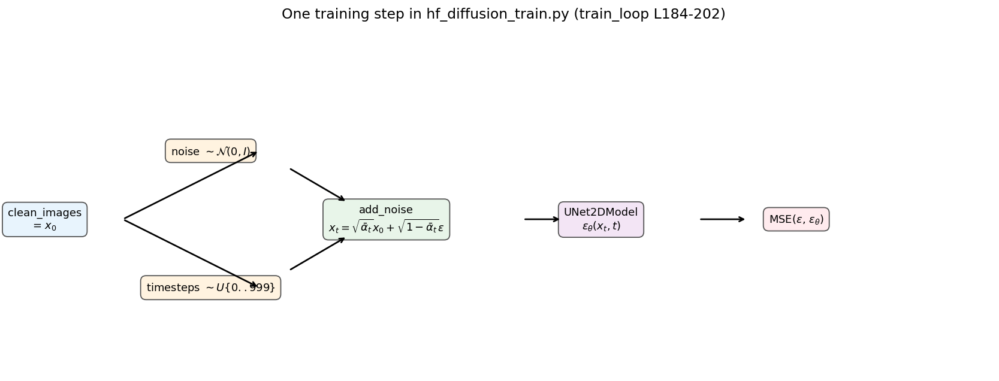
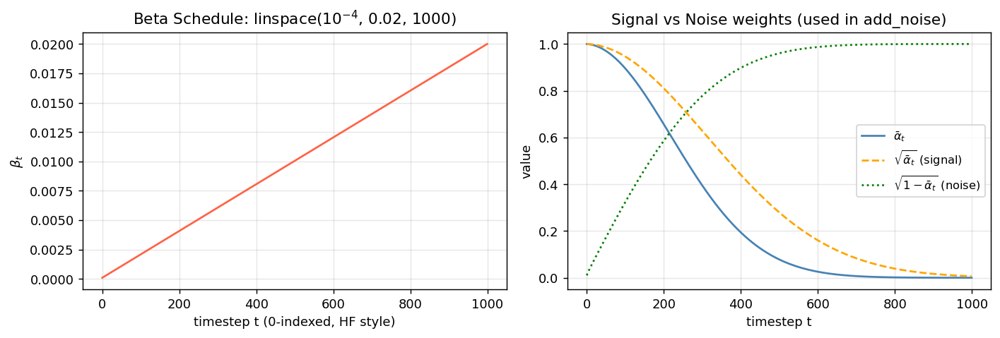
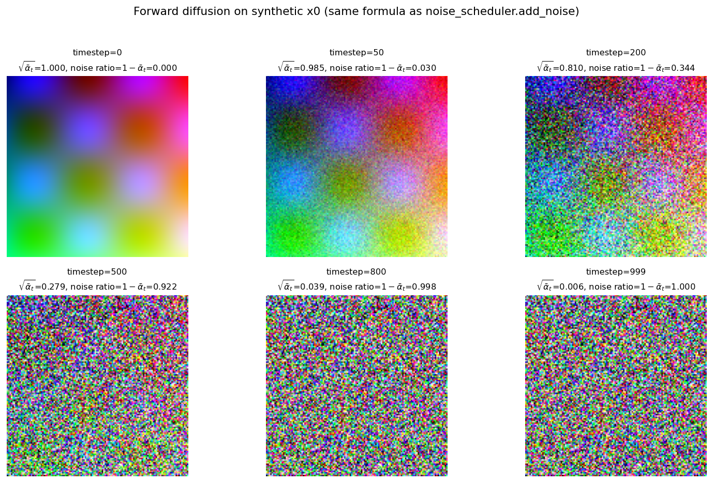
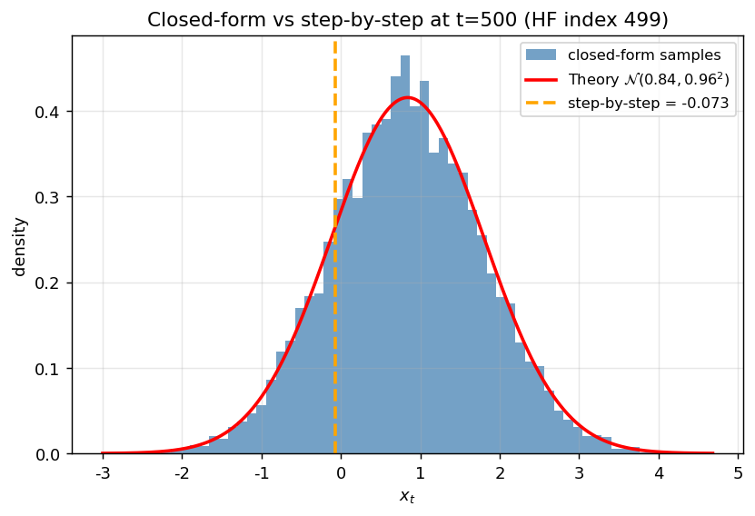
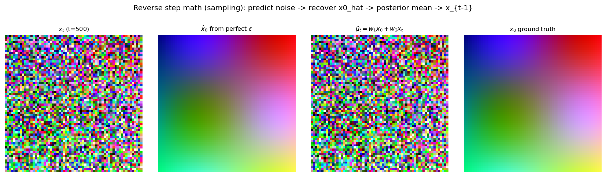
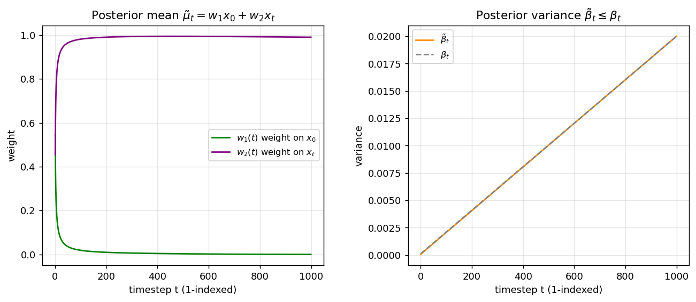

# HF DDPM 训练脚本数学详解

> 对照文件：[`../hf_diffusion_train.py`](../hf_diffusion_train.py)  
> 数学基础：[`../section01_intro/README.md`](../section01_intro/README.md)  
> 可视化脚本：[`visualize_math.py`](visualize_math.py)（**纯 NumPy / Matplotlib，无需 diffusers / GPU**）

---

## 目录

1. [整体架构](#一整体架构)
2. [数据预处理：$x_0$ 从哪来](#二数据预处理x_0-从哪来)
3. [DDPMScheduler：Beta Schedule 与 add_noise](#三ddpmschedulerbeta-schedule-与-add_noise)
4. [闭合公式推导（数学核心）](#四闭合公式推导数学核心)
5. [UNet2DModel：$\varepsilon_\theta(x_t, t)$](#五unet2dmodel-varepsilon_theta-x_t-t)
6. [训练循环：一步训练的完整数学](#六训练循环一步训练的完整数学)
7. [反向采样：DDPMPipeline 与 step()](#七反向采样ddpmpipeline-与-step)
8. [后验分布 $q(x_{t-1}\mid x_t, x_0)$](#八后验分布-qx_t-1mid-x_t-x_0)
9. [索引约定：HF 0-index vs 论文 1-index](#九索引约定hf-0-index-vs-论文-1-index)
10. [文件与运行方式](#十文件与运行方式)

---

## 一、整体架构

`hf_diffusion_train.py` 是 HuggingFace Diffusers 官方教程的 DDPM 训练脚本，其数学与 Section 01 完全一致，只是用库函数封装了公式。

```
┌─────────────────────────────────────────────────────────────────┐
│                        训练阶段（train_loop）                      │
│                                                                 │
│  x₀ (clean_images)                                              │
│    + ε ~ N(0,I)  +  t ~ Uniform{0..999}                         │
│         ↓                                                       │
│  add_noise  →  x_t = √ᾱ_t·x₀ + √(1-ᾱ_t)·ε   【正向，固定公式】    │
│         ↓                                                       │
│  UNet(x_t, t)  →  ε_θ(x_t, t)              【网络，需学习】       │
│         ↓                                                       │
│  MSE(ε, ε_θ)                                 【损失】             │
└─────────────────────────────────────────────────────────────────┘

┌─────────────────────────────────────────────────────────────────┐
│                     采样阶段（DDPMPipeline）                       │
│                                                                 │
│  x_T ~ N(0, I)                                                  │
│    ↓  t = 999, 998, ..., 0                                      │
│  ε_θ = UNet(x_t, t)                                             │
│  x̂₀ = (x_t - √(1-ᾱ_t)·ε_θ) / √ᾱ_t                               │
│  x_{t-1} ~ N(μ̃_t(x_t, x̂₀), β̃_t·I)                             │
│    ↓ 重复 1000 步                                                │
│  x₀  生成的蝴蝶图                                                  │
└─────────────────────────────────────────────────────────────────┘
```



---

## 二、数据预处理：$x_0$ 从哪来

### 2.1 代码位置

```python
# hf_diffusion_train.py L42-58
preprocess = transforms.Compose([
    transforms.Resize((128, 128)),
    transforms.RandomHorizontalFlip(),
    transforms.ToTensor(),              # [0,255] → [0,1]
    transforms.Normalize([0.5], [0.5]), # [0,1]  → [-1,1]
])
```

### 2.2 数学含义

| 步骤 | 操作 | 值域 |
|------|------|------|
| `ToTensor()` | 除以 255 | $[0, 1]$ |
| `Normalize(0.5, 0.5)` | $x' = (x - 0.5) / 0.5 = 2x - 1$ | $[-1, 1]$ |

DDPM 论文假设数据大致在 $[-1, 1]$，与高斯噪声 $\mathcal{N}(0, I)$ 尺度匹配。

训练循环里的 `clean_images = batch["images"]` 就是数学符号 **$x_0$**，形状 `[B, 3, 128, 128]`。

---

## 三、DDPMScheduler：Beta Schedule 与 add_noise

### 3.1 代码位置

```python
# hf_diffusion_train.py L98-101
noise_scheduler = DDPMScheduler(num_train_timesteps=1000)
noise = torch.randn(sample_image.shape)
timesteps = torch.LongTensor([50])
noisy_image = noise_scheduler.add_noise(sample_image, noise, timesteps)
```

### 3.2 Scheduler 内部构造了什么

`DDPMScheduler(num_train_timesteps=1000)` 默认使用 **线性 Beta Schedule**：

$$
\beta_t = \text{linspace}(10^{-4},\ 0.02,\ 1000), \quad
\alpha_t = 1 - \beta_t, \quad
\bar\alpha_t = \prod_{s=1}^{t} \alpha_s
$$

我们在 `visualize_math.py` 里用 NumPy **手写等价实现**（无需安装 diffusers）：

```python
def make_schedule(num_train_timesteps=1000):
    betas = np.linspace(1e-4, 0.02, num_train_timesteps)
    alphas = 1.0 - betas
    alphas_cumprod = np.cumprod(alphas)          # 即 ᾱ_t
    alphas_cumprod_prev = np.concatenate([[1.0], alphas_cumprod[:-1]])
    return {"betas": betas, "alphas": alphas,
            "alphas_cumprod": alphas_cumprod, ...}
```



**读图要点**：
- 左：$\beta_t$ 线性从 $10^{-4}$ 增至 $0.02$，早期加噪少、后期加噪多。
- 右：$\sqrt{\bar\alpha_t}$（橙虚线）随 $t$ 下降 → 信号逐渐消失；$\sqrt{1-\bar\alpha_t}$（绿点线）上升 → 噪声占主导。

### 3.3 add_noise 的数学

HuggingFace 源码（`scheduling_ddpm.py`）核心就三行：

```python
sqrt_alpha_prod = alphas_cumprod[timesteps] ** 0.5
sqrt_one_minus_alpha_prod = (1 - alphas_cumprod[timesteps]) ** 0.5
noisy_samples = sqrt_alpha_prod * original_samples + sqrt_one_minus_alpha_prod * noise
```

即 Section 01 的 **闭合公式**：

$$
\boxed{x_t = \sqrt{\bar\alpha_t}\,x_0 + \sqrt{1-\bar\alpha_t}\,\varepsilon}
$$

| 代码变量 | 数学符号 |
|---------|---------|
| `original_samples` / `sample_image` | $x_0$ |
| `noise` | $\varepsilon \sim \mathcal{N}(0, I)$ |
| `timesteps` | $t$ |
| `noisy_image` / return value | $x_t$ |



**读图要点**：同一张 $x_0$，固定噪声 $\varepsilon$，不同 $t$ 下 `add_noise` 的输出。$t=0$ 几乎无噪；$t=999$ 接近纯噪声。

---

## 四、闭合公式推导（数学核心）

### 4.1 为什么需要闭合公式

单步马尔可夫加噪：

$$
q(x_t \mid x_{t-1}) = \mathcal{N}\!\left(x_t;\ \sqrt{\alpha_t}\,x_{t-1},\ (1-\alpha_t)\mathbf{I}\right)
$$

采样：$x_t = \sqrt{\alpha_t}\,x_{t-1} + \sqrt{1-\alpha_t}\,\varepsilon_t$

若从 $x_0$ 逐步迭代到 $x_t$，需要循环 $t$ 次。训练时每个 batch 随机采 $t \in \{0,\ldots,999\}$，逐步迭代太慢。

### 4.2 推导（两步推广到 $t$ 步）

展开 $x_2$：

$$
\begin{aligned}
x_2 &= \sqrt{\alpha_2}\,x_1 + \sqrt{1-\alpha_2}\,\varepsilon_2 \\
    &= \sqrt{\alpha_2}\!\left(\sqrt{\alpha_1}\,x_0 + \sqrt{1-\alpha_1}\,\varepsilon_1\right) + \sqrt{1-\alpha_2}\,\varepsilon_2 \\
    &= \sqrt{\alpha_1\alpha_2}\,x_0 + \underbrace{\sqrt{\alpha_2(1-\alpha_1)}\,\varepsilon_1 + \sqrt{1-\alpha_2}\,\varepsilon_2}_{\text{独立高斯线性组合}}
\end{aligned}
$$

**高斯可加性**：$\mathcal{N}(0, a^2 I) + \mathcal{N}(0, b^2 I) = \mathcal{N}(0, (a^2+b^2) I)$

噪声项方差：$\alpha_2(1-\alpha_1) + (1-\alpha_2) = 1 - \alpha_1\alpha_2 = 1 - \bar\alpha_2$

归纳得：

$$
q(x_t \mid x_0) = \mathcal{N}\!\left(x_t;\ \sqrt{\bar\alpha_t}\,x_0,\ (1-\bar\alpha_t)\mathbf{I}\right)
$$

### 4.3 数值验证

`visualize_math.py` 对比两种方法：

- **方法 A**：从 $x_0=3.0$ 逐步迭代 500 步
- **方法 B**：闭合公式采样 10000 次，看分布



蓝 histogram 与红色理论高斯 $\mathcal{N}(\sqrt{\bar\alpha_t} x_0,\ 1-\bar\alpha_t)$ 完全吻合；橙色虚线是逐步迭代的一个样本点，落在分布内。

---

## 五、UNet2DModel：$\varepsilon_\theta(x_t, t)$

### 5.1 代码位置

```python
# hf_diffusion_train.py L63-90
model = UNet2DModel(
    sample_size=128,
    in_channels=3,    # RGB 输入 x_t
    out_channels=3,   # 预测 3 通道噪声 ε
    ...
)
noise_pred = model(noisy_image, timesteps).sample  # L112, L201
```

### 5.2 数学角色

网络学习 **噪声预测函数**：

$$
\varepsilon_\theta: \mathbb{R}^{3\times128\times128} \times \{0,\ldots,999\} \to \mathbb{R}^{3\times128\times128}
$$

- **输入**：带噪图 $x_t$ + 时间步 $t$
- **输出**：与 $x_t$ 同形状的噪声预测 $\varepsilon_\theta(x_t, t)$
- **时间嵌入**：$t$ 被编码（正弦位置编码 + MLP）后注入 U-Net 各层，让网络知道当前噪声强度

Section 01 只定义了 $\varepsilon_\theta$ 的接口；U-Net 结构在 Section 04 展开。此处只需知道：**它就是一个接受 $(x_t, t)$ 、输出同尺寸张量的函数**。

---

## 六、训练循环：一步训练的完整数学

### 6.1 代码位置

```python
# hf_diffusion_train.py L184-202
clean_images = batch["images"]                                    # x₀
noise = torch.randn(clean_images.shape, ...)                      # ε
timesteps = torch.randint(0, 1000, (bs,), ...)                     # t
noisy_images = noise_scheduler.add_noise(clean_images, noise, timesteps)  # x_t
noise_pred = model(noisy_images, timesteps, return_dict=False)[0]  # ε_θ
loss = F.mse_loss(noise_pred, noise)                               # L
```

### 6.2 逐步对照

| 步骤 | 代码 | 数学 |
|:----:|------|------|
| ① | `clean_images` | $x_0 \sim q_{\text{data}}(x_0)$ |
| ② | `noise = torch.randn(...)` | $\varepsilon \sim \mathcal{N}(0, I)$ |
| ③ | `timesteps = randint(0, 1000, ...)` | $t \sim \text{Uniform}\{0,\ldots,999\}$ |
| ④ | `add_noise(...)` | $x_t = \sqrt{\bar\alpha_t}\,x_0 + \sqrt{1-\bar\alpha_t}\,\varepsilon$ |
| ⑤ | `model(noisy_images, timesteps)` | $\varepsilon_\theta(x_t, t)$ |
| ⑥ | `F.mse_loss(noise_pred, noise)` | $\|\varepsilon - \varepsilon_\theta\|^2$ |

### 6.3 损失函数

Section 01 给出的 ELBO 化简结果：

$$
\boxed{\mathcal{L} = \mathbb{E}_{t,\,x_0,\,\varepsilon}\!\left[\left\|\varepsilon - \varepsilon_\theta\!\left(\sqrt{\bar\alpha_t}\,x_0 + \sqrt{1-\bar\alpha_t}\,\varepsilon,\ t\right)\right\|^2\right]}
$$

**本质**：给定 $(x_t, t)$，预测加入的噪声，与真实 $\varepsilon$ 做 MSE。没有对抗训练、没有 VAE 的 KL 项，形式极其简洁。

### 6.4 演示 cell（L109-113）

脚本在正式训练前有一个 **单步演示**：

```python
noise_pred = model(noisy_image, timesteps).sample
loss = F.mse_loss(noise_pred, noise)
```

未训练的网络 `loss` 会很大（约 1~2）；训练后下降到 0.01 以下。这验证了整条数据流是通的。

---

## 七、反向采样：DDPMPipeline 与 step()

### 7.1 代码位置

```python
# hf_diffusion_train.py L129-135, L219
pipeline = DDPMPipeline(unet=model, scheduler=noise_scheduler)
images = pipeline(batch_size=16, generator=...).images
```

注释写得很清楚：`Sample some images from random noise (this is the backward diffusion process).`

### 7.2 采样算法（伪代码）

```
x_T ~ N(0, I)
for t = T-1, T-2, ..., 0:
    ε_θ = UNet(x_t, t)
    x̂_0 = (x_t - √(1-ᾱ_t) · ε_θ) / √ᾱ_t          # 由闭合公式反解
    μ̃_t = w₁(t)·x̂_0 + w₂(t)·x_t                   # 后验均值
    z ~ N(0, I)  if t > 0 else 0
    x_{t-1} = μ̃_t + √β̃_t · z
return x_0
```

### 7.3 反推 $\hat x_0$

由 $x_t = \sqrt{\bar\alpha_t}\,x_0 + \sqrt{1-\bar\alpha_t}\,\varepsilon$ 移项：

$$
\hat x_0 = \frac{x_t - \sqrt{1-\bar\alpha_t}\,\varepsilon_\theta(x_t, t)}{\sqrt{\bar\alpha_t}}
$$

`DDPMScheduler.step()` 在 `prediction_type="epsilon"` 时正是这行（diffusers 源码 L515）。

### 7.4 可视化：完美噪声预测时的反向一步



在 $t=500$ 时，若网络 **完美预测** $\varepsilon$，则 $\hat x_0 \approx x_0$，后验均值 $\tilde\mu_t = w_1 x_0 + w_2 x_t$ 是 $x_0$ 与 $x_t$ 的加权组合，作为 $x_{t-1}$ 的期望。

---

## 八、后验分布 $q(x_{t-1}\mid x_t, x_0)$

### 8.1 为什么可解

$q(x_{t-1}\mid x_t)$ 需要对数据分布积分，不可解析。但 **条件于 $x_0$** 时，贝叶斯公式三项都是高斯：

$$
q(x_{t-1}\mid x_t, x_0) = \frac{q(x_t\mid x_{t-1})\,q(x_{t-1}\mid x_0)}{q(x_t\mid x_0)}
= \mathcal{N}(x_{t-1};\ \tilde\mu_t,\ \tilde\beta_t \mathbf{I})
$$

### 8.2 后验均值与方差

$$
\tilde\mu_t = \underbrace{\frac{\sqrt{\bar\alpha_{t-1}}\,\beta_t}{1-\bar\alpha_t}}_{w_1(t)}\,x_0 + \underbrace{\frac{\sqrt{\alpha_t}(1-\bar\alpha_{t-1})}{1-\bar\alpha_t}}_{w_2(t)}\,x_t
$$

$$
\tilde\beta_t = \frac{1-\bar\alpha_{t-1}}{1-\bar\alpha_t}\cdot\beta_t
$$



**读图要点**：
- 左：$t$ 小时 $w_1 \approx w_2$，$x_0$ 和 $x_t$ 各贡献约一半；$t$ 大时 $w_2 \to 1$，几乎只看 $x_t$。
- 右：$\tilde\beta_t \leq \beta_t$，后验方差恒小于单步方差，采样更稳定。

### 8.3 与 `scheduler.step()` 的对应

diffusers 源码（`prediction_type="epsilon"`）：

```python
pred_original_sample = (sample - sqrt(1-ᾱ_t) * model_output) / sqrt(ᾱ_t)   # x̂₀
pred_original_sample_coeff = sqrt(ᾱ_{t-1}) * β_t / (1 - ᾱ_t)               # w₁
current_sample_coeff       = sqrt(α_t) * (1 - ᾱ_{t-1}) / (1 - ᾱ_t)         # w₂
pred_prev_sample = w₁ * pred_original_sample + w₂ * sample                  # μ̃_t
# 再加 sqrt(β̃_t) * z
```

与 Section 01 公式 **逐项一致**，只是把 $x_0$ 换成了 $\hat x_0$。

---

## 九、索引约定：HF 0-index vs 论文 1-index

| | HuggingFace (本脚本) | Section 01 README |
|--|---------------------|-------------------|
| 时间步范围 | `0, 1, ..., 999` | $1, 2, \ldots, 1000$ |
| `alphas_cumprod[t]` | 对应论文 $\bar\alpha_{t+1}$ | $\bar\alpha_t$ |
| `randint(0, 1000)` | $t \in \{0,\ldots,999\}$ | $t \in \{1,\ldots,1000\}$ |

**换算**：HF 的 `timestep=50` ≈ 论文的 $t=51$，使用 `alphas_cumprod[50]`。

运行 `visualize_math.py` 会打印对照表：

```
HF 0-index timestep | sqrt(ab) | sqrt(1-ab) | w1       | w2
  t=   0            | 0.9999   | 0.0100     |   -      |   -
  t=  50            | 0.9849   | 0.1733     | 0.0359   | 0.9641
  t= 200            | 0.8102   | 0.5862     | 0.0096   | 0.9901
  t= 500            | 0.2789   | 0.9603     | 0.0031   | 0.9941
  t= 999            | 0.0064   | 1.0000     | 0.0001   | 0.9899
```

---

## 十、文件与运行方式

### 10.1 目录结构

```
hf_diffusion/
├── README.md              ← 本文件
├── visualize_math.py      ← 纯 NumPy 可视化（无需 diffusers/GPU）
└── assets/
    ├── 01_scheduler.png           Beta Schedule + 信号/噪声权重
    ├── 02_closed_form_verify.png  闭合公式 vs 逐步迭代
    ├── 03_posterior.png           后验 w₁, w₂, β̃_t
    ├── 04_image_forward_noise.png 图像正向加噪（模拟 add_noise）
    ├── 05_add_noise_equivalence.png
    ├── 06_training_flow.png       训练一步数据流
    └── 07_reverse_step.png        反向单步示意
```

### 10.2 生成可视化（当前机器可直接运行）

```bash
conda activate ddpm_learn
cd /root/autodl-tmp/ddpm_learn/hf_diffusion
python visualize_math.py
```

依赖：`numpy`, `matplotlib`, `scipy`（均已在 `ddpm_learn` 环境中）。

### 10.3 运行完整训练（需要 GPU + diffusers）

`hf_diffusion_train.py` 还需：`torch`, `diffusers`, `datasets`, `accelerate`, `torchvision`。

等机器配置好 NVIDIA 驱动和 CUDA 后再安装 diffusers 并训练：

```bash
pip install diffusers datasets accelerate torchvision
python ../hf_diffusion_train.py
```

---

## 附录 A：代码 ↔ 公式速查表

| 公式 | hf_diffusion_train.py | visualize_math.py |
|------|----------------------|-------------------|
| $\beta_t$ linear schedule | `DDPMScheduler(1000)` 内部 | `make_schedule()` |
| $x_t = \sqrt{\bar\alpha_t}x_0 + \sqrt{1-\bar\alpha_t}\varepsilon$ | `add_noise()` | `add_noise()` |
| $\varepsilon_\theta(x_t, t)$ | `UNet2DModel(...)` | — |
| $\mathcal{L} = \|\varepsilon - \varepsilon_\theta\|^2$ | `F.mse_loss(...)` | — |
| $\hat x_0 = (x_t - \sqrt{1-\bar\alpha_t}\varepsilon_\theta)/\sqrt{\bar\alpha_t}$ | `scheduler.step()` 内部 | `predict_x0()` |
| $\tilde\mu_t = w_1 x_0 + w_2 x_t$ | `scheduler.step()` 内部 | `posterior_mean()` |

## 附录 B：与 section01_intro 的关系

| Section 01 内容 | section01_intro | hf_diffusion | 本 README 可视化 |
|----------------|-----------------|--------------|-----------------|
| Beta Schedule | `01_forward_noise_demo.py` | `DDPMScheduler` | `01_scheduler.png` |
| 闭合公式 | `forward_diffusion()` | `add_noise()` | `02`, `04` |
| 后验均值 | `02_math_visualization.py` | `scheduler.step()` | `03_posterior.png` |
| 损失函数 | README 伪代码 | `train_loop` L202 | `06_training_flow.png` |
| 采样 | 尚未实现 | `DDPMPipeline` | `07_reverse_step.png` |

---

## 下一节

- **Section 02**：正向过程完整马尔可夫链推导
- **Section 03**：ELBO → KL 散度 → 为何 MSE 预测噪声是最优目标
- 配置 GPU 后运行 `hf_diffusion_train.py` 观察 loss 下降与生成样本
