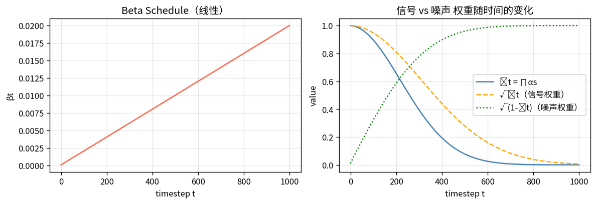
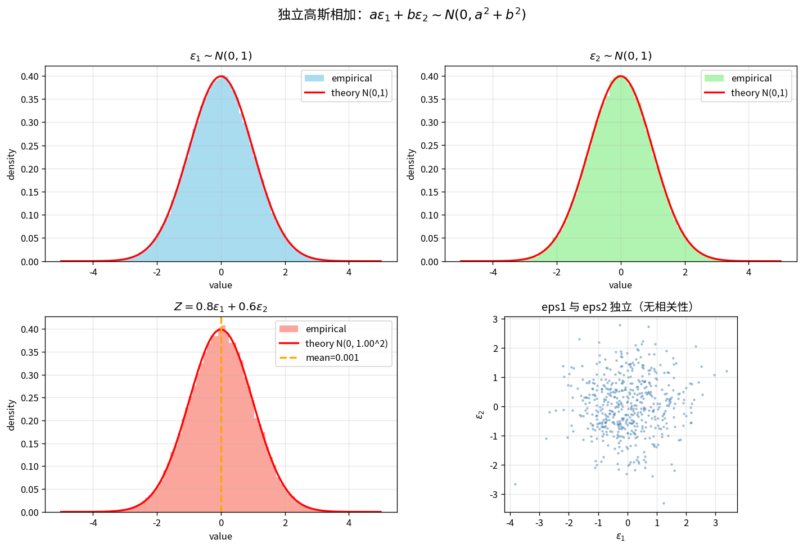
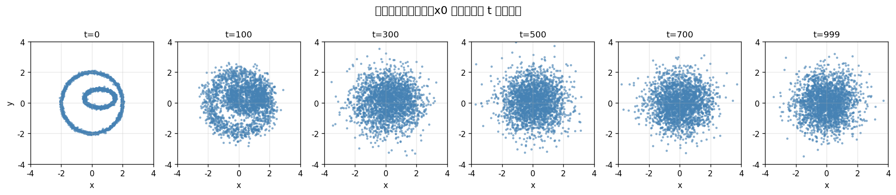
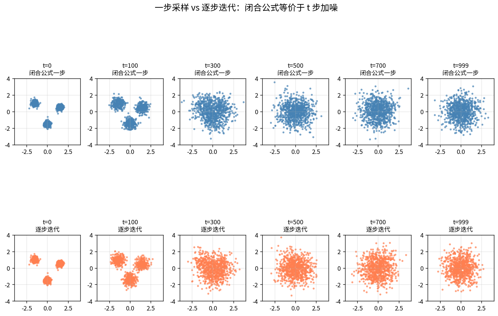
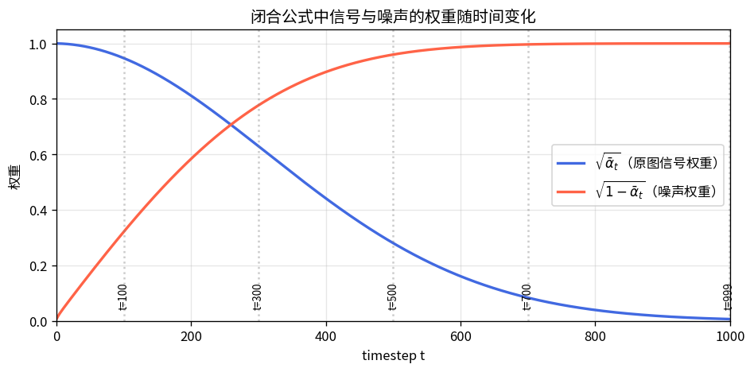
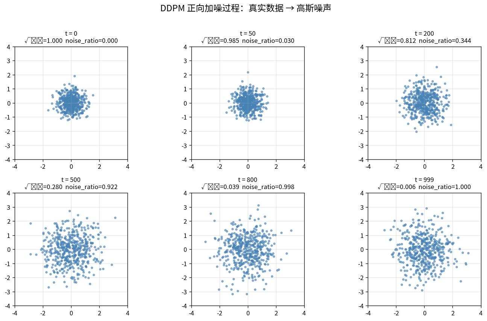
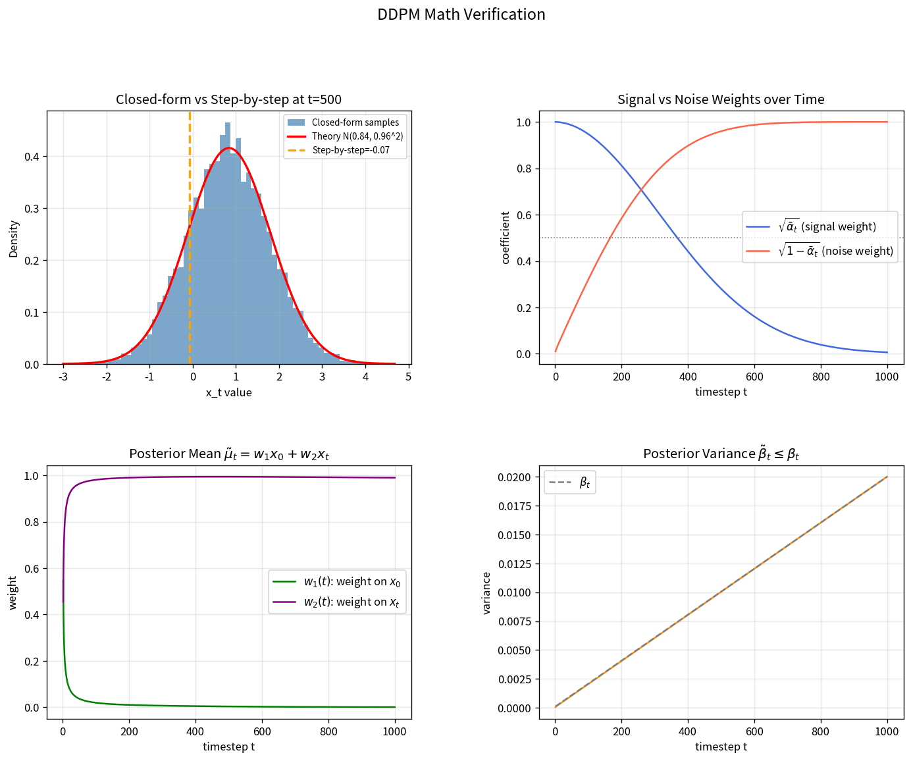

# Section 01 - DDPM 直觉与正向加噪

## 本节目标

- 理解 DDPM 的核心思想：正向加噪 + 反向去噪
- 掌握正向过程的**闭合公式**，无需逐步迭代
- 理解 Beta Schedule 的作用
- 理解后验分布 $q(x_{t-1}\mid x_t, x_0)$ 的解析形式

## 本节目录

- 一、整体思路
- 二、正向过程数学推导
  - 2.1 单步加噪
  - 2.2 Beta Schedule
  - 2.3 闭合公式推导
  - 2.4 为什么可以合并高斯？（方差相加）
  - 2.5 一步采样的意义
- 三、反向过程数学推导
  - 3.1 为什么反向过程可解？
  - 3.2 后验均值与方差
- 四、神经网络与损失函数
  - 4.1 网络的角色
  - 4.2 损失函数

---

## 一、整体思路

```
正向（加噪）：x0 → x1 → x2 → ... → xT ≈ N(0,I)
反向（去噪）：xT → ... → x1 → x0  ← 神经网络学习
```

DDPM 与其他生成模型对比：

| 模型 | 思路 | 问题 |
|------|------|------|
| GAN | 生成器 vs 判别器博弈 | 训练不稳定、模式崩溃 |
| VAE | 编码到隐空间再解码 | 生成质量偏模糊 |
| **DDPM** | **逐步去噪马尔可夫链** | 质量高，采样慢 |

---

## 二、正向过程数学推导

### 2.1 单步加噪

每一步加噪是一个**条件高斯分布**（马尔可夫链）：

$$q(x_t \mid x_{t-1}) = \mathcal{N}\!\left(x_t;\ \sqrt{1-\beta_t}\,x_{t-1},\ \beta_t \mathbf{I}\right)$$

采样写法：

$$x_t = \sqrt{1-\beta_t}\cdot x_{t-1} + \sqrt{\beta_t}\cdot\varepsilon_t, \quad \varepsilon_t\sim\mathcal{N}(0,I)$$

- $\beta_t$ 很小（$10^{-4}$ 到 $0.02$），每步只加一点点噪声
- 信号系数 $\sqrt{1-\beta_t} < 1$，幅度略微缩小防止方差爆炸

```python
# 单步加噪（逐步迭代，效率低）
def forward_step(x_prev, t):
    eps = np.random.randn(*x_prev.shape)
    return np.sqrt(alphas[t]) * x_prev + np.sqrt(betas[t]) * eps
```

### 2.2 Beta Schedule

$$\beta_t \in [10^{-4},\ 0.02] \quad\text{线性递增}$$

$$\alpha_t = 1-\beta_t, \qquad \bar\alpha_t = \prod_{s=1}^{t}\alpha_s$$

| 符号 | 含义 |
|------|------|
| $\beta_t$ | 第 $t$ 步加噪强度，线性从 $10^{-4}$ 增至 $0.02$ |
| $\alpha_t = 1-\beta_t$ | 单步信号保留比例 |
| $\bar\alpha_t = \prod_{s=1}^{t}\alpha_s$ | 累积信号保留比例（$t$ 越大越接近 $0$） |
| $\sqrt{\bar\alpha_t}$ | $x_t$ 中原始信号的权重 |
| $\sqrt{1-\bar\alpha_t}$ | $x_t$ 中噪声的权重 |

```python
T = 1000
betas         = np.linspace(1e-4, 0.02, T)   # β_1 ... β_T
alphas        = 1.0 - betas                   # α_t = 1 - β_t
alpha_cumprod = np.cumprod(alphas)            # ᾱ_t = ∏ α_s
```

> 📊 **可视化**：`01_schedules.png` — $\beta_t$、$\bar\alpha_t$、信号/噪声权重随时间变化



### 2.3 闭合公式推导（关键！）

**问题**：从 $x_0$ 走 $t$ 步到 $x_t$，需要迭代 $t$ 次吗？

**不需要！** 利用**重参数化 + 高斯可加性**，一步到位。

令 $\alpha_t = 1 - \beta_t$，展开两步：

$$x_2 = \sqrt{\alpha_2}\,x_1 + \sqrt{1-\alpha_2}\,\varepsilon_2$$
$$= \sqrt{\alpha_2}\!\left(\sqrt{\alpha_1}\,x_0 + \sqrt{1-\alpha_1}\,\varepsilon_1\right) + \sqrt{1-\alpha_2}\,\varepsilon_2$$
$$= \sqrt{\alpha_1\alpha_2}\,x_0 + \underbrace{\sqrt{\alpha_2(1-\alpha_1)}\,\varepsilon_1 + \sqrt{1-\alpha_2}\,\varepsilon_2}_{\text{两个独立高斯，合并！}}$$

合并高斯（方差相加）：$\mathcal{N}(0,a^2I)+\mathcal{N}(0,b^2I)=\mathcal{N}(0,(a^2+b^2)I)$

$$\text{合并方差} = \alpha_2(1-\alpha_1)+(1-\alpha_2) = 1-\alpha_1\alpha_2$$

推广到 $t$ 步：

$$\boxed{x_t = \sqrt{\bar\alpha_t}\cdot x_0 + \sqrt{1-\bar\alpha_t}\cdot\varepsilon, \quad \varepsilon\sim\mathcal{N}(0,I)}$$

即 $q(x_t\mid x_0) = \mathcal{N}\!\left(x_t;\ \sqrt{\bar\alpha_t}\,x_0,\ (1-\bar\alpha_t)I\right)$

### 2.4 为什么可以合并高斯？（方差相加）

若：
$$X \sim \mathcal{N}(\mu_X, \sigma_X^2), \quad Y \sim \mathcal{N}(\mu_Y, \sigma_Y^2), \quad X \perp Y$$

则：
$$Z = X + Y \sim \mathcal{N}(\mu_X+\mu_Y,\ \sigma_X^2+\sigma_Y^2)$$

在 DDPM 中：
$$a\varepsilon_1 + b\varepsilon_2 \sim \mathcal{N}(0,\ a^2+b^2),\quad \varepsilon_1,\varepsilon_2\sim\mathcal{N}(0,1)$$

**为什么方差相加？** 从定义出发：

$$\text{Var}(a\varepsilon_1 + b\varepsilon_2) = a^2\text{Var}(\varepsilon_1) + b^2\text{Var}(\varepsilon_2) + 2\underbrace{\text{Cov}(a\varepsilon_1,b\varepsilon_2)}_{\text{独立}=0} = a^2+b^2$$

关键条件：
- **独立**：协方差为 0，交叉项消失
- **高斯**：高斯分布具有**再生性**，独立高斯相加仍是高斯

```python
# 验证：a*eps1 + b*eps2 ~ N(0, a^2+b^2)
a, b = 0.8, 0.6
eps1 = np.random.randn(100000)
eps2 = np.random.randn(100000)
z = a * eps1 + b * eps2

print(f"理论方差: a^2+b^2 = {a**2+b**2:.4f}")
print(f"采样方差: {z.var():.4f}")
print(f"相关系数: {np.corrcoef(eps1, eps2)[0,1]:.4f}  (接近0=独立)")
```

> 📊 **可视化**：`03_gaussian_addition.png` — 独立高斯相加前后的分布对比，验证方差相加



```python
# 闭合公式：从 x0 一步直接采样任意时刻 x_t
def forward_diffusion(x0, t):
    sqrt_alpha_bar  = np.sqrt(alpha_cumprod[t])      # 信号权重
    sqrt_one_minus  = np.sqrt(1 - alpha_cumprod[t])  # 噪声权重
    eps = np.random.randn(*x0.shape)
    xt  = sqrt_alpha_bar * x0 + sqrt_one_minus * eps
    return xt, eps   # 返回带噪样本和噪声（训练时需要）

# 调用示例：直接得到第 500 步的噪声图
x0 = np.random.randn(28, 28)          # 原始图片
xt, eps = forward_diffusion(x0, 500)  # 一步得到 x_500
```

### 2.5 一步采样的意义

> 📊 **可视化 0**：`05_direct_xt.png` — 同一个原图，用闭合公式一步生成不同 $t$ 的噪声图



**闭合公式最重要的结论：想生成 $x_t$，不需要真的迭代 $t$ 次！**

因为每一步都是高斯加噪，而高斯分布具有可加性，连续 $t$ 次加噪等价于一次加噪。这带来两个关键好处：

1. **训练高效**：训练时随机选一个 $t$，从原图 $x_0$ 一步生成 $x_t$ 即可，不需要模拟 1000 步
2. **采样快速**：中间任意时刻都可以直接计算，不需要从 $x_0$ 开始逐步加噪

| 时间步 $t$ | $\sqrt{\bar\alpha_t}$（信号权重） | $\sqrt{1-\bar\alpha_t}$（噪声权重） | 直观效果 |
|-----------|----------------------------------|------------------------------------|---------|
| 0 | 1.0 | 0.0 | 就是原图 $x_0$ |
| 100 | ≈0.95 | ≈0.31 | 基本还是原图，带一点噪声 |
| 500 | ≈0.48 | ≈0.88 | 噪声占主导，但还有痕迹 |
| 999 | ≈0.006 | ≈1.0 | 几乎就是纯噪声 |

> 📊 **可视化 1**：`04_one_step_sampling.png` — 上排为闭合公式一步采样，下排为逐步迭代 $t$ 步，二者分布几乎一致



> 📊 **可视化 2**：`04_weight_curve.png` — 不同 $t$ 处信号与噪声的权重，与表格对应



> 📊 **可视化 3**：`01_forward_noise.png` — 不同 $t$ 下点云从聚集到弥散的过程



> 📊 **验证**：`02_math_visualization.png` 左上图 — 闭合公式采样分布与理论高斯完全吻合

---

## 三、反向过程数学推导

### 3.1 为什么反向过程可解？

真实反向分布 $q(x_{t-1}\mid x_t)$ 需要积分遍历整个数据集，**不可解**。

但加入条件 $x_0$ 后，用**贝叶斯公式**可得解析解：

$$q(x_{t-1}\mid x_t, x_0) = \frac{q(x_t\mid x_{t-1})\,q(x_{t-1}\mid x_0)}{q(x_t\mid x_0)}$$

三项均为高斯分布（正向过程已知），展开指数项合并，结果仍为高斯：

$$q(x_{t-1}\mid x_t, x_0) = \mathcal{N}(x_{t-1};\ \tilde\mu_t(x_t, x_0),\ \tilde\beta_t I)$$

### 3.2 后验均值与方差

$$\tilde\mu_t = \underbrace{\frac{\sqrt{\bar\alpha_{t-1}}\,\beta_t}{1-\bar\alpha_t}}_{w_1(t)}\,x_0 + \underbrace{\frac{\sqrt{\alpha_t}(1-\bar\alpha_{t-1})}{1-\bar\alpha_t}}_{w_2(t)}\,x_t$$

$$\tilde\beta_t = \frac{1-\bar\alpha_{t-1}}{1-\bar\alpha_t}\cdot\beta_t \quad\text{（后验方差，固定值，不需要学习）}$$

```python
alpha_cumprod_prev = np.concatenate([[1.0], alpha_cumprod[:-1]])  # ᾱ_{t-1}

# 后验均值的两个权重
w1 = np.sqrt(alpha_cumprod_prev[1:]) * betas[1:] / (1 - alpha_cumprod[1:])
w2 = np.sqrt(alphas[1:]) * (1 - alpha_cumprod_prev[1:]) / (1 - alpha_cumprod[1:])

# 后验方差（固定，无需学习）
beta_tilde = (1 - alpha_cumprod_prev[1:]) / (1 - alpha_cumprod[1:]) * betas[1:]

def posterior_mean(x0, xt, t):
    return w1[t] * x0 + w2[t] * xt
```

后验均值权重随时间的变化：

| 时间步 $t$ | $w_1$（$x_0$ 权重） | $w_2$（$x_t$ 权重） | 直觉 |
|-----------|--------------------|--------------------|------|
| $t=2$（早期）| $\approx 0.545$ | $\approx 0.455$ | 两者各贡献约一半 |
| $t=500$（中期）| $\approx 0.003$ | $\approx 0.994$ | $x_t$ 主导 |
| $t=999$（末期）| $\approx 0.000$ | $\approx 0.990$ | 完全依赖带噪输入 |

> 📊 **可视化**：`02_math_visualization.png` 右下两图 — $w_1$、$w_2$、$\tilde\beta_t$ 随时间变化



---

## 四、神经网络与损失函数

### 4.1 网络的角色

实际中 $x_0$ 未知，DDPM 训练网络 $\varepsilon_\theta(x_t, t)$ **预测噪声** $\varepsilon$，再反推 $\hat x_0$：

$$\hat x_0 = \frac{x_t - \sqrt{1-\bar\alpha_t}\,\varepsilon_\theta(x_t,t)}{\sqrt{\bar\alpha_t}}$$

```python
def predict_x0(xt, eps_pred, t):
    return (xt - np.sqrt(1 - alpha_cumprod[t]) * eps_pred) / np.sqrt(alpha_cumprod[t])
```

将 $\hat x_0$ 代入 $\tilde\mu_t$，即可完成每步去噪采样。

### 4.2 损失函数（ELBO 化简结果）

$$\boxed{\mathcal{L} = \mathbb{E}_{t,x_0,\varepsilon}\!\left[\|\varepsilon - \varepsilon_\theta\!\left(\underbrace{\sqrt{\bar\alpha_t}x_0+\sqrt{1-\bar\alpha_t}\varepsilon}_{x_t},\ t\right)\|^2\right]}$$

**本质**：输入带噪图 $x_t$ 和时间步 $t$，预测噪声，和真实噪声算 MSE。极其简洁！

```python
def compute_loss(model, x0, t):
    eps = torch.randn_like(x0)                          # 采样真实噪声
    sqrt_ab  = alpha_cumprod[t] ** 0.5                  # √ᾱt
    sqrt_1ab = (1 - alpha_cumprod[t]) ** 0.5            # √(1-ᾱt)
    xt = sqrt_ab * x0 + sqrt_1ab * eps                  # 闭合公式构造 x_t
    eps_pred = model(xt, t)                             # 网络预测噪声
    return F.mse_loss(eps_pred, eps)                    # MSE 损失
```

---

## 文件说明

| 文件 | 说明 |
|------|------|
| `01_forward_noise_demo.py` | 正向加噪过程点云可视化 |
| `01_forward_noise.png` | 不同时间步 $t$ 下点云的扩散效果 |
| `01_schedules.png` | $\beta_t$、$\bar\alpha_t$、信号/噪声权重随时间变化 |
| `02_math_visualization.py` | 闭合公式验证 + 后验均值权重可视化 |
| `02_math_visualization.png` | 数学原理四图：分布验证、权重曲线、后验均值、后验方差 |
| `03_gaussian_addition.py` | 独立高斯相加原理：方差相加验证 |
| `03_gaussian_addition.png` | 高斯相加分布对比可视化 |
| `04_one_step_sampling.py` | 一步采样：闭合公式 vs 逐步迭代对比 |
| `04_one_step_sampling.png` | 一步采样与逐步迭代分布对比 |
| `04_weight_curve.png` | 信号/噪声权重随时间变化曲线 |
| `05_direct_xt_visual.py` | 一步直接到 t 步的噪声图可视化 |
| `05_direct_xt.png` | 同一原图在不同 t 下的噪声变化 |

## 运行

```bash
conda activate ddpm_learn
python 01_forward_noise_demo.py   # 正向加噪可视化
python 02_math_visualization.py   # 数学原理验证
python 03_gaussian_addition.py    # 高斯合并原理可视化
python 04_one_step_sampling.py    # 一步采样对比可视化
python 05_direct_xt_visual.py     # 一步直接到 t 步可视化
```

---

## 下一节预告

**Section 02**：损失函数完整推导（ELBO → KL 散度 → 简化 MSE）+ 采样算法伪代码实现。
