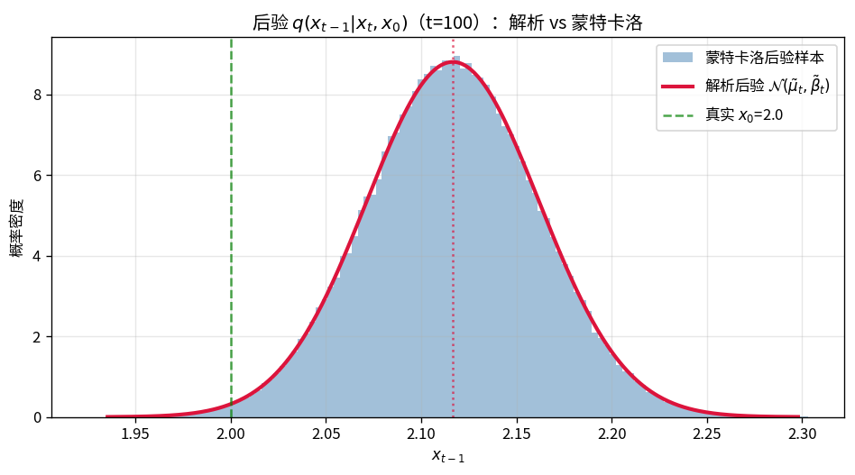
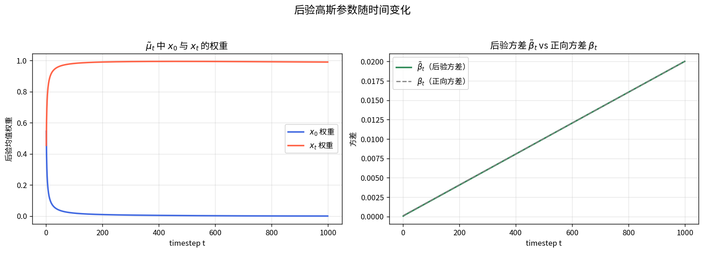
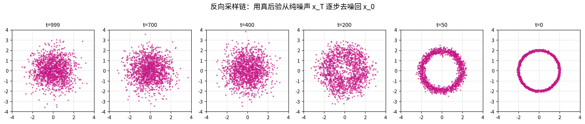

# Section 02 - 反向过程推导（后验 q(x_{t-1} | x_t, x_0)）

## 本节目标

- 理解为什么真实反向分布 $q(x_{t-1}\mid x_t)$ 无法直接求解
- **逐步**掌握贝叶斯 + 配方法（completing the square）的完整代数推导
- 得到后验均值 $\tilde\mu_t$、后验方差 $\tilde\beta_t$，并理解其物理意义
- 掌握 $\tilde\mu_t$ 的「噪声形式」改写（训练/采样直接用到）
- 用蒙特卡洛验证推导，并用真后验完成一次反向去噪采样

---

## 一、为什么不能直接求 $q(x_{t-1}\mid x_t)$

DDPM 的目标是学习反向去噪。理想情况下我们想要真实反向分布：

$$q(x_{t-1}\mid x_t) = \frac{q(x_t\mid x_{t-1})\,q(x_{t-1})}{q(x_t)}$$

但 $q(x_{t-1})$ 与 $q(x_t)$ 都是**边缘分布**，需要对未知的真实数据分布 $q(x_0)$ 积分：

$$q(x_t) = \int q(x_t\mid x_0)\,q(x_0)\,dx_0$$

$q(x_0)$ 未知，积分不可行 → **真实反向分布无法解析求出**。

**关键技巧**：如果额外以 $x_0$ 为条件，$q(x_{t-1}\mid x_t, x_0)$ 就完全可解（三个高斯都已知）。这正是训练时能用到的「监督信号」。

---

## 二、贝叶斯展开

$$q(x_{t-1}\mid x_t, x_0) = \frac{q(x_t\mid x_{t-1}, x_0)\,q(x_{t-1}\mid x_0)}{q(x_t\mid x_0)}$$

由于正向是马尔可夫链，$q(x_t\mid x_{t-1}, x_0)=q(x_t\mid x_{t-1})$。三项全部已知：

| 项 | 分布 | 来源 |
|----|------|------|
| $q(x_t\mid x_{t-1})$ | $\mathcal{N}(\sqrt{\alpha_t}\,x_{t-1},\ \beta_t I)$ | 正向单步加噪 |
| $q(x_{t-1}\mid x_0)$ | $\mathcal{N}(\sqrt{\bar\alpha_{t-1}}\,x_0,\ (1-\bar\alpha_{t-1})I)$ | 闭合公式（$t-1$ 步） |
| $q(x_t\mid x_0)$ | $\mathcal{N}(\sqrt{\bar\alpha_t}\,x_0,\ (1-\bar\alpha_t)I)$ | 闭合公式（$t$ 步） |

对应代码（见 `01_posterior_reverse.py`）：

```python
T = 1000
betas = np.linspace(1e-4, 0.02, T)
alphas = 1.0 - betas
alpha_cumprod = np.cumprod(alphas)
alpha_cumprod_prev = np.concatenate([[1.0], alpha_cumprod[:-1]])  # ᾱ_{t-1}
```

---

## 三、配方法逐步推导

三项都是高斯，乘除后取对数，关于 $x_{t-1}$ 仍是二次型，所以后验必为高斯。我们只需收集 $x_{t-1}$ 的二次项和一次项。

### 3.1 写出对数概率（忽略与 $x_{t-1}$ 无关的常数）

$$\log q(x_{t-1}\mid x_t, x_0) \propto -\frac{1}{2}\left[\frac{(x_t-\sqrt{\alpha_t}\,x_{t-1})^2}{\beta_t} + \frac{(x_{t-1}-\sqrt{\bar\alpha_{t-1}}\,x_0)^2}{1-\bar\alpha_{t-1}}\right]$$

（分母 $q(x_t\mid x_0)$ 不含 $x_{t-1}$，并入常数。）

### 3.2 把两个平方逐项展开

先单独展开方括号里的两个平方项，**只保留含 $x_{t-1}$ 的部分**，其余并入常数 $C$。

第一项（来自 $q(x_t\mid x_{t-1})$）：

$$\frac{(x_t-\sqrt{\alpha_t}\,x_{t-1})^2}{\beta_t}
= \frac{x_t^2 - 2\sqrt{\alpha_t}\,x_t x_{t-1} + \alpha_t x_{t-1}^2}{\beta_t}
= \frac{\alpha_t}{\beta_t}x_{t-1}^2 - \frac{2\sqrt{\alpha_t}}{\beta_t}x_t\,x_{t-1} + C$$

第二项（来自 $q(x_{t-1}\mid x_0)$）：

$$\frac{(x_{t-1}-\sqrt{\bar\alpha_{t-1}}\,x_0)^2}{1-\bar\alpha_{t-1}}
= \frac{x_{t-1}^2 - 2\sqrt{\bar\alpha_{t-1}}\,x_0 x_{t-1} + \bar\alpha_{t-1}x_0^2}{1-\bar\alpha_{t-1}}
= \frac{1}{1-\bar\alpha_{t-1}}x_{t-1}^2 - \frac{2\sqrt{\bar\alpha_{t-1}}}{1-\bar\alpha_{t-1}}x_0\,x_{t-1} + C$$

### 3.3 按 $x_{t-1}$ 的幂次合并同类项

把上面两项的 $x_{t-1}^2$ 系数相加、$x_{t-1}$ 系数相加：

$$\log q \propto -\frac{1}{2}\left[\underbrace{\left(\frac{\alpha_t}{\beta_t}+\frac{1}{1-\bar\alpha_{t-1}}\right)}_{x_{t-1}^2\ \text{系数 }=:A}x_{t-1}^2 - 2\underbrace{\left(\frac{\sqrt{\alpha_t}}{\beta_t}x_t+\frac{\sqrt{\bar\alpha_{t-1}}}{1-\bar\alpha_{t-1}}x_0\right)}_{x_{t-1}\ \text{系数（一半）}=:B}x_{t-1}\right] + C$$

### 3.4 对照标准高斯读出 $\mu,\sigma^2$

把标准高斯的对数也展开成同样的「二次项 + 一次项」形式：

$$-\frac{1}{2\sigma^2}(x-\mu)^2 = -\frac{1}{2\sigma^2}x^2 + \frac{\mu}{\sigma^2}x + C$$

逐项对照系数（$x_{t-1}^2$ 对 $x^2$、$x_{t-1}$ 对 $x$）：

$$\frac{1}{\sigma^2} = A,\qquad \frac{\mu}{\sigma^2} = B\ \Longrightarrow\ \sigma^2 = \frac{1}{A},\quad \mu = \frac{B}{A} = \sigma^2 B$$

这就是「方差 = 二次项系数的倒数」「均值 = 方差 × 一次项系数（的一半）」的来历。

**方差**（二次项系数 $A$ 的倒数）：

$$\frac{1}{\tilde\beta_t} = \frac{\alpha_t}{\beta_t}+\frac{1}{1-\bar\alpha_{t-1}} = \frac{\alpha_t(1-\bar\alpha_{t-1})+\beta_t}{\beta_t(1-\bar\alpha_{t-1})}$$

分子 $\alpha_t(1-\bar\alpha_{t-1})+\beta_t = \alpha_t-\alpha_t\bar\alpha_{t-1}+\beta_t = (\alpha_t+\beta_t)-\bar\alpha_t = 1-\bar\alpha_t$，所以

$$\boxed{\tilde\beta_t = \frac{1-\bar\alpha_{t-1}}{1-\bar\alpha_t}\,\beta_t}$$

**均值**（$\mu = \tilde\beta_t \times$ 一次项系数的一半）：

$$\tilde\mu_t = \tilde\beta_t\left(\frac{\sqrt{\alpha_t}}{\beta_t}x_t+\frac{\sqrt{\bar\alpha_{t-1}}}{1-\bar\alpha_{t-1}}x_0\right)$$

把 $\tilde\beta_t = \dfrac{1-\bar\alpha_{t-1}}{1-\bar\alpha_t}\beta_t$ 分别乘进两个括号项，**让公因子约掉**：

$x_t$ 的系数：

$$\tilde\beta_t\cdot\frac{\sqrt{\alpha_t}}{\beta_t}
= \frac{1-\bar\alpha_{t-1}}{1-\bar\alpha_t}\,\beta_t\cdot\frac{\sqrt{\alpha_t}}{\beta_t}
= \frac{\sqrt{\alpha_t}(1-\bar\alpha_{t-1})}{1-\bar\alpha_t}\quad(\beta_t\ \text{约掉})$$

$x_0$ 的系数：

$$\tilde\beta_t\cdot\frac{\sqrt{\bar\alpha_{t-1}}}{1-\bar\alpha_{t-1}}
= \frac{1-\bar\alpha_{t-1}}{1-\bar\alpha_t}\,\beta_t\cdot\frac{\sqrt{\bar\alpha_{t-1}}}{1-\bar\alpha_{t-1}}
= \frac{\sqrt{\bar\alpha_{t-1}}\,\beta_t}{1-\bar\alpha_t}\quad((1-\bar\alpha_{t-1})\ \text{约掉})$$

合起来：

$$\boxed{\tilde\mu_t = \frac{\sqrt{\bar\alpha_{t-1}}\,\beta_t}{1-\bar\alpha_t}\,x_0 + \frac{\sqrt{\alpha_t}(1-\bar\alpha_{t-1})}{1-\bar\alpha_t}\,x_t}$$

### 3.5 代码实现

```python
def posterior_beta(t):
    return (1 - alpha_cumprod_prev[t]) / (1 - alpha_cumprod[t]) * betas[t]

def posterior_mean(x0, xt, t):
    coef_x0 = np.sqrt(alpha_cumprod_prev[t]) * betas[t] / (1 - alpha_cumprod[t])
    coef_xt = np.sqrt(alphas[t]) * (1 - alpha_cumprod_prev[t]) / (1 - alpha_cumprod[t])
    return coef_x0 * x0 + coef_xt * xt
```

> **注意** $\tilde\beta_t$ 只依赖 schedule，是**固定常数，不需要学习**。模型只需预测均值（等价于预测噪声 $\varepsilon$）。

---

## 四、均值的「噪声形式」

上面的 $\tilde\mu_t$ 同时依赖 $x_0$ 和 $x_t$。训练时拿不到 $x_0$，所以把 $x_0$ 用 $x_t,\varepsilon$ 表示，换成只依赖 $x_t$ 和噪声 $\varepsilon$ 的形式。

**第一步：反解 $x_0$**。由闭合公式 $x_t=\sqrt{\bar\alpha_t}\,x_0+\sqrt{1-\bar\alpha_t}\,\varepsilon$：

$$x_0=\frac{1}{\sqrt{\bar\alpha_t}}\left(x_t-\sqrt{1-\bar\alpha_t}\,\varepsilon\right)$$

**第二步：代入 $\tilde\mu_t = c_0 x_0 + c_t x_t$**（$c_0,c_t$ 是上一节的两个系数）。先处理 $c_0 x_0$ 项，关键用 $\bar\alpha_t=\alpha_t\bar\alpha_{t-1}$ 得 $\sqrt{\bar\alpha_{t-1}}=\sqrt{\bar\alpha_t}/\sqrt{\alpha_t}$：

$$c_0 x_0
= \frac{\sqrt{\bar\alpha_{t-1}}\,\beta_t}{1-\bar\alpha_t}\cdot\frac{x_t-\sqrt{1-\bar\alpha_t}\,\varepsilon}{\sqrt{\bar\alpha_t}}
= \frac{\beta_t}{\sqrt{\alpha_t}(1-\bar\alpha_t)}\left(x_t-\sqrt{1-\bar\alpha_t}\,\varepsilon\right)$$

**第三步：合并 $x_t$ 的系数**。$x_t$ 总系数为 $c_t + \dfrac{\beta_t}{\sqrt{\alpha_t}(1-\bar\alpha_t)}$，通分后分子：

$$\beta_t + \alpha_t(1-\bar\alpha_{t-1}) = \beta_t + \alpha_t - \bar\alpha_t = 1-\bar\alpha_t$$

所以 $x_t$ 系数 $= \dfrac{1-\bar\alpha_t}{\sqrt{\alpha_t}(1-\bar\alpha_t)} = \dfrac{1}{\sqrt{\alpha_t}}$。$\varepsilon$ 系数为 $-\dfrac{\beta_t}{\sqrt{\alpha_t}\sqrt{1-\bar\alpha_t}}$。最终：

$$\boxed{\tilde\mu_t = \frac{1}{\sqrt{\alpha_t}}\left(x_t - \frac{\beta_t}{\sqrt{1-\bar\alpha_t}}\,\varepsilon\right)}$$

这就是训练目标的由来：网络 $\varepsilon_\theta(x_t,t)$ 预测噪声，采样时直接代入该式。

```python
mu_noise_form = (1 / np.sqrt(alphas[t])) * (
    xt - betas[t] / np.sqrt(1 - alpha_cumprod[t]) * eps
)
```

---

## 五、实例（t=100, x0=2.0）

脚本输出：

```
实例：t=100, x0=2.0, x_t=2.1189
  解析后验均值 μ̃_t   = 2.116604
  解析后验方差 β̃_t   = 0.00205455
噪声形式  μ̃_t = 2.116604   # 与 x0/xt 形式完全一致
```

后验均值非常接近 $x_t$，方差很小：早期步 $x_t$ 几乎已确定 $x_{t-1}$。

---

## 六、蒙特卡洛验证

用重要性采样独立验证推导：从先验 $q(x_{t-1}\mid x_0)$ 采样，用似然 $q(x_t\mid x_{t-1})$ 加权，加权统计量应收敛到解析后验。

```python
samples = np.random.randn(N) * prior_std + prior_mean
log_w = -0.5 * (xt - np.sqrt(alphas[t]) * samples) ** 2 / betas[t]
w = np.exp(log_w - log_w.max()); w /= w.sum()
mc_mean = np.sum(w * samples)
mc_var  = np.sum(w * (samples - mc_mean) ** 2)
```

输出 `MC 后验均值=2.116572 (解析 2.116604)`、`MC 后验方差=0.00206061 (解析 0.00205455)`，吻合。





**权重直觉**：$t$ 越大，$x_0$ 权重越小、$x_t$ 权重越接近 1 —— 后期去噪几乎只依赖当前带噪输入。

---

## 七、反向采样链（真后验去噪）

已知 $x_0$ 时，用真后验 $q(x_{t-1}\mid x_t,x_0)$ 从纯噪声 $x_T$ 逐步采样回 $x_0$，验证反向过程确能恢复数据：

```python
def reverse_step(xt, x0, t):
    mu = posterior_mean(x0, xt, t)
    if t == 0:
        return mu
    return mu + np.sqrt(posterior_beta(t)) * np.random.randn(*xt.shape)
```



> 真实场景拿不到 $x_0$，所以训练一个网络预测噪声 $\varepsilon_\theta$ 来近似 $\tilde\mu_t$ —— 这是 Section 03 的内容。

---

## 文件说明

| 文件 | 说明 |
|------|------|
| `01_posterior_reverse.py` | 后验推导实现、蒙特卡洛验证、噪声形式验证、可视化 |
| `01_posterior_weights.png` | 后验均值权重 + 方差随时间变化 |
| `01_posterior_dist.png` | 解析后验高斯 vs 蒙特卡洛直方图 |
| `01_reverse_chain.png` | 用真后验从 $x_T$ 去噪回 $x_0$ 的采样链 |

## 运行

```bash
conda activate ddpm_learn
python 01_posterior_reverse.py
```

---

## 下一节预告

**Section 03**：损失函数完整推导 —— 从 ELBO 到简化 MSE，解释为什么训练目标是预测噪声 $\varepsilon$。
