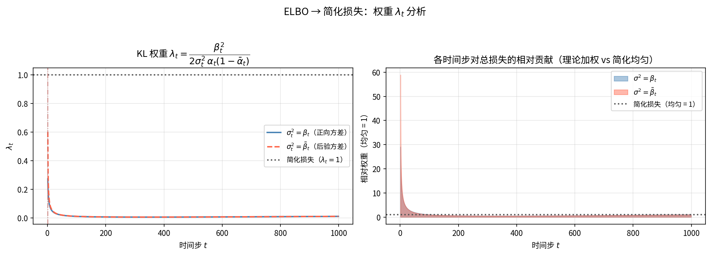
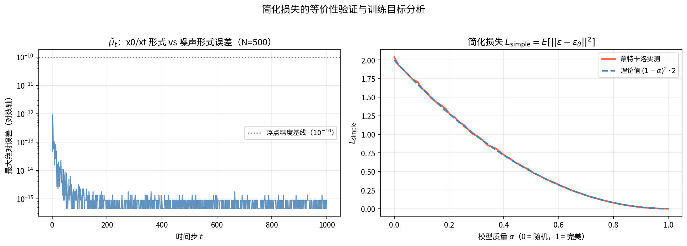
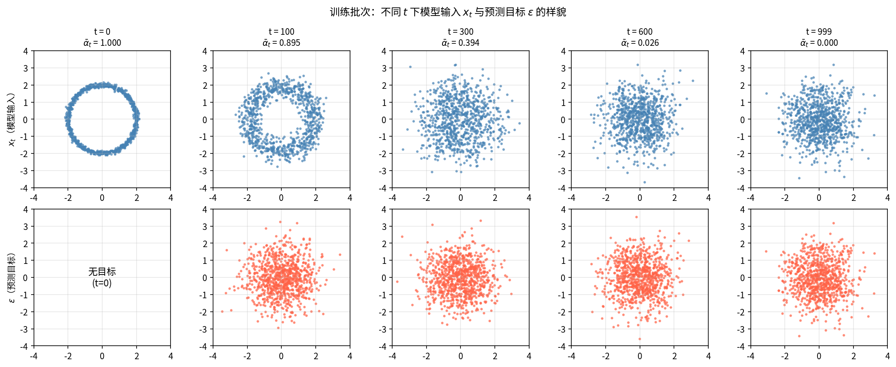

# Section 03 - 损失函数：ELBO → 简化 MSE

## 本节目标

- 从变分推断角度推导 DDPM 的训练目标（ELBO）
- 将 KL 散度项化简为均值的 MSE，再进一步化为**噪声 MSE**
- 理解 $\lambda_t$ 权重，掌握 Ho et al. 简化损失的直觉
- 数值验证 $\tilde\mu_t$ 两种形式等价，理解完整训练流程

---

## 一、ELBO 从哪里来

我们想最大化数据的对数似然 $\log p_\theta(x_0)$，但它要对所有中间变量积分，算不出来。做法是**乘除一个我们能算的分布 $q(x_{1:T}|x_0)$，再用 Jensen 不等式压下界**。

**第一步：引入 $q$ 并用 Jensen 不等式**：

$$\log p_\theta(x_0) = \log\int p_\theta(x_{0:T})\,dx_{1:T}
= \log\mathbb{E}_q\!\left[\frac{p_\theta(x_{0:T})}{q(x_{1:T}|x_0)}\right]
\ \ge\ \mathbb{E}_q\!\left[\log\frac{p_\theta(x_{0:T})}{q(x_{1:T}|x_0)}\right] =: \text{ELBO}$$

**第二步：展开两个联合分布为马尔可夫连乘积**（$p$ 反向、$q$ 正向）：

$$p_\theta(x_{0:T}) = p(x_T)\prod_{t=1}^{T}p_\theta(x_{t-1}|x_t),\qquad
q(x_{1:T}|x_0) = \prod_{t=1}^{T}q(x_t|x_{t-1})$$

**第三步：把正向单步改写成后验**。对 $t\ge 2$ 用贝叶斯（马尔可夫）：

$$q(x_t|x_{t-1}) = q(x_t|x_{t-1},x_0) = \frac{q(x_{t-1}|x_t,x_0)\,q(x_t|x_0)}{q(x_{t-1}|x_0)}$$

代回连乘积后，$\dfrac{q(x_t|x_0)}{q(x_{t-1}|x_0)}$ 连乘会**望远镜式抵消**，只剩首尾项，整理后得到三组：

$$\log p_\theta(x_0) \ge \underbrace{-D_{\rm KL}(q(x_T|x_0)\|p(x_T))}_{-L_T}
+ \sum_{t=2}^{T}\underbrace{-D_{\rm KL}(q(x_{t-1}|x_t,x_0)\|p_\theta(x_{t-1}|x_t))}_{-L_{t-1}}
+ \underbrace{\mathbb{E}_q[\log p_\theta(x_0|x_1)]}_{-L_0}$$

（望远镜抵消 + 合并同期望为 KL 的详细步骤可参考 Ho et al. 2020 附录 A。）

| 项 | 含义 | 是否优化 |
|----|------|---------|
| $L_T$ | 最终噪声与先验的 KL | ✗（与 $\theta$ 无关） |
| $L_{t-1}$ | 后验 $q$ 与模型 $p_\theta$ 的 KL | ✓（主要训练信号） |
| $L_0$ | 重建项 | ✓（实践中用 MSE） |

```python
T = 1000
betas = np.linspace(1e-4, 0.02, T)
alphas = 1.0 - betas
alpha_cumprod = np.cumprod(alphas)                                # ᾱ_t
alpha_cumprod_prev = np.concatenate([[1.0], alpha_cumprod[:-1]]) # ᾱ_{t-1}
tilde_beta = (1 - alpha_cumprod_prev) / (1 - alpha_cumprod) * betas  # β̃_t
```

---

## 二、$L_{t-1}$：KL → 均值 MSE

两者都是高斯：后验 $q$ 的方差是固定的 $\tilde\beta_t$，模型 $p_\theta$ 的方差也设为同一个固定常数 $\sigma_t^2$（不学习）。**两个等方差高斯的 KL 有闭式公式**：

$$D_{\rm KL}\big(\mathcal{N}(\mu_q,\sigma^2 I)\,\|\,\mathcal{N}(\mu_p,\sigma^2 I)\big)
= \frac{1}{2\sigma^2}\|\mu_q-\mu_p\|^2$$

（同方差时，KL 公式中的 $\log\frac{\sigma_p}{\sigma_q}$ 和迹项全为零，只剩均值差项。）代入：

$$L_{t-1} = D_{\rm KL}(q(x_{t-1}|x_t,x_0)\|p_\theta(x_{t-1}|x_t))
= \frac{1}{2\sigma_t^2}\|\tilde\mu_t(x_t,x_0) - \mu_\theta(x_t,t)\|^2$$

其中 $\sigma_t^2$ 是固定常数（两种常见选取见下文）。

---

## 三、代入噪声形式

由 Section 02 的结论（$\tilde\mu_t$ 噪声形式）：

$$\tilde\mu_t = \frac{1}{\sqrt{\alpha_t}}\!\left(x_t - \frac{\beta_t}{\sqrt{1-\bar\alpha_t}}\,\varepsilon\right)$$

模型对应设为：

$$\mu_\theta(x_t,t) = \frac{1}{\sqrt{\alpha_t}}\!\left(x_t - \frac{\beta_t}{\sqrt{1-\bar\alpha_t}}\,\varepsilon_\theta(x_t,t)\right)$$

两个均值只有括号里的 $\varepsilon$ vs $\varepsilon_\theta$ 不同，**相减时 $x_t$ 项抵消**：

$$\tilde\mu_t - \mu_\theta
= \frac{1}{\sqrt{\alpha_t}}\!\left[-\frac{\beta_t}{\sqrt{1-\bar\alpha_t}}\varepsilon\right] - \frac{1}{\sqrt{\alpha_t}}\!\left[-\frac{\beta_t}{\sqrt{1-\bar\alpha_t}}\varepsilon_\theta\right]
= \frac{\beta_t}{\sqrt{\alpha_t}\sqrt{1-\bar\alpha_t}}\big(\varepsilon_\theta - \varepsilon\big)$$

取平方范数（系数平方提出，符号不影响平方）：

$$\|\tilde\mu_t - \mu_\theta\|^2 = \left(\frac{\beta_t}{\sqrt{\alpha_t}\sqrt{1-\bar\alpha_t}}\right)^2\|\varepsilon - \varepsilon_\theta\|^2 = \frac{\beta_t^2}{\alpha_t(1-\bar\alpha_t)}\|\varepsilon - \varepsilon_\theta(x_t,t)\|^2$$

因此：

$$\boxed{L_{t-1} = \underbrace{\frac{\beta_t^2}{2\sigma_t^2\,\alpha_t(1-\bar\alpha_t)}}_{\lambda_t}\cdot\|\varepsilon - \varepsilon_\theta(x_t,t)\|^2}$$

```python
# 方案 A：σ_t² = β_t
lambda_A = betas[ts] / (2 * alphas[ts] * (1 - alpha_cumprod[ts]))

# 方案 B：σ_t² = β̃_t（后验方差）
lambda_B = betas[ts]**2 / (2 * tilde_beta[ts] * alphas[ts] * (1 - alpha_cumprod[ts]))
```

---

## 四、$\sigma_t^2$ 的两种选取

| 选取 | 表达式 | 特点 |
|------|--------|------|
| $\sigma_t^2 = \beta_t$ | $\lambda_t = \dfrac{\beta_t}{2\alpha_t(1-\bar\alpha_t)}$ | 简单，小 $t$ 略大 |
| $\sigma_t^2 = \tilde\beta_t$ | $\lambda_t = \dfrac{\beta_t}{2\alpha_t(1-\bar\alpha_{t-1})}$ | 理论最优（后验方差） |

两种方案的 $\lambda_t$ 随 $t$ 减小（均小于 1，大噪步被低估）：



> **直觉**：$\lambda_t < 1$ 意味着加权损失**低估**了大噪声步的重要性。简化损失（$\lambda_t = 1$）均匀对待所有步，实验上生成质量更好（Ho et al. 2020, Sec. 3.4）。

---

## 五、简化损失

$$\boxed{L_{\rm simple} = \mathbb{E}_{t\sim\mathcal{U}[1,T],\, x_0,\, \varepsilon\sim\mathcal{N}(0,I)}\!\left[\|\varepsilon - \varepsilon_\theta(\underbrace{\sqrt{\bar\alpha_t}\,x_0+\sqrt{1-\bar\alpha_t}\,\varepsilon}_{x_t},\, t)\|^2\right]}$$

这就是 DDPM 的最终训练目标。训练循环极为简洁：

```python
# 一个训练步
t   = np.random.randint(0, T)                          # 随机时间步
eps = np.random.randn(*x0.shape)                       # 随机噪声
xt  = np.sqrt(alpha_cumprod[t]) * x0 + \
      np.sqrt(1 - alpha_cumprod[t]) * eps              # 加噪
loss = np.mean((eps - eps_theta(xt, t))**2)            # MSE
```

---

## 六、数值验证

### 6.1 $\tilde\mu_t$ 两种形式等价

代入 $x_0 = \frac{1}{\sqrt{\bar\alpha_t}}(x_t - \sqrt{1-\bar\alpha_t}\,\varepsilon)$ 代数变换严格可逆，数值误差在浮点精度内（$\sim 10^{-14}$）：

```python
def mu_x0_form(x0, xt, t):
    c0 = np.sqrt(alpha_cumprod_prev[t]) * betas[t] / (1 - alpha_cumprod[t])
    ct = np.sqrt(alphas[t]) * (1 - alpha_cumprod_prev[t]) / (1 - alpha_cumprod[t])
    return c0 * x0 + ct * xt

def mu_eps_form(xt, eps, t):
    return (1 / np.sqrt(alphas[t])) * (
        xt - betas[t] / np.sqrt(1 - alpha_cumprod[t]) * eps
    )
```

### 6.2 简化损失随模型质量的变化

令 $\varepsilon_\theta = \alpha\cdot\varepsilon_{\rm true} + (1-\alpha)\cdot\varepsilon_{\rm rand}$（$\alpha$ 表示模型质量），理论上：

$$L_{\rm simple} = (1-\alpha)^2 \cdot 2d \quad (d\text{ 为维度})$$



### 6.3 训练批次样貌

不同时间步下，模型输入 $x_t$ 与预测目标 $\varepsilon$ 的分布：



> 注意：无论 $t$ 多大，**预测目标 $\varepsilon$ 始终是 $\mathcal{N}(0,I)$**（标准正态），这使得 MSE 损失的量纲不随 $t$ 变化——简化损失的数值稳定性来源之一。

---

## 文件说明

| 文件 | 说明 |
|------|------|
| `01_elbo_weights.py` | ELBO 分解说明、$\lambda_t$ 曲线、相对贡献分析 |
| `02_noise_prediction.py` | $\tilde\mu_t$ 等价性验证、$L_{\rm simple}$ 曲线、训练批次可视化 |
| `01_elbo_weights.png` | $\lambda_t$ 曲线 + 相对贡献图 |
| `02_simplified_loss.png` | 等价性误差 + 损失曲线 |
| `02_training_samples.png` | 不同 $t$ 下 $x_t$ 与 $\varepsilon$ 的样貌 |

## 运行

```bash
conda activate ddpm_learn
python 01_elbo_weights.py
python 02_noise_prediction.py
```

---

## 下一节预告

**Section 04**：U-Net 架构 —— 时间嵌入（Sinusoidal Embedding）+ 残差 U-Net，理解 $\varepsilon_\theta(x_t, t)$ 的网络设计。
