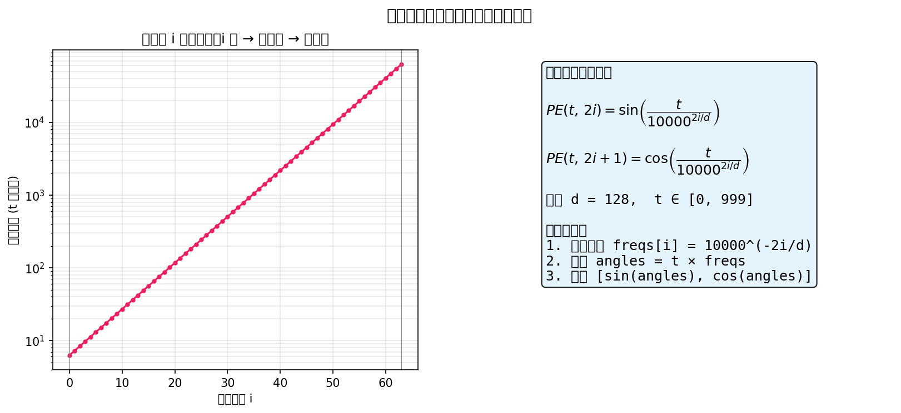
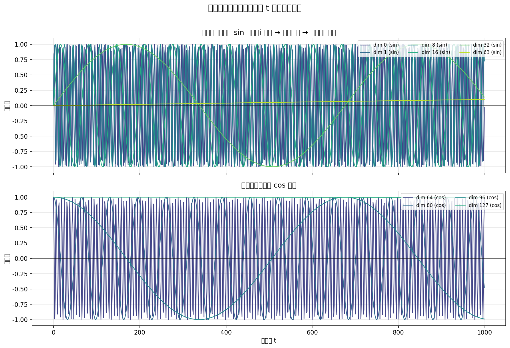
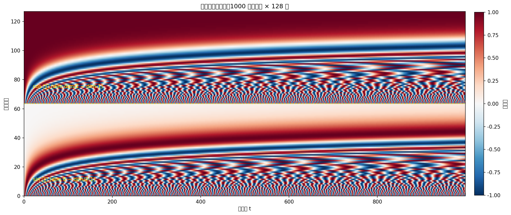
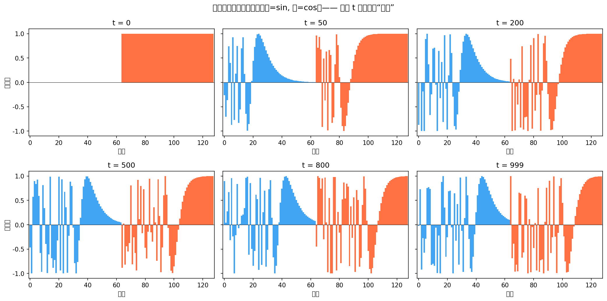
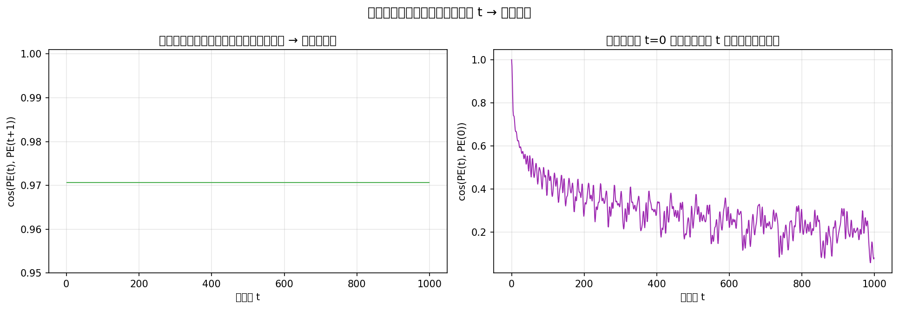

# 正弦时间嵌入可视化说明

> 配套脚本：[`00_sinusoidal_embedding_visualization.py`](./00_sinusoidal_embedding_visualization.py)  
> 图片目录：[`figures/`](./figures/)

---

## 一、什么是正弦时间嵌入？

在 DDPM 中，去噪网络 $\varepsilon_\theta(x_t, t)$ 需要知道当前处于哪一个加噪/去噪阶段。时间步 $t$ 原本只是一个整数（如 $0 \sim 999$），无法直接作为神经网络的输入。

**正弦时间嵌入（Sinusoidal Position Embedding）** 将标量 $t$ 映射为高维连续向量 $\text{PE}(t) \in \mathbb{R}^d$，使网络能够区分不同时间步，并理解时间步之间的相对关系。

该方法源自 Transformer 的位置编码，DDPM 论文直接沿用。

---

## 二、数学公式

对时间步 $t$、嵌入维度 $d$，第 $i$ 对维度（$i = 0, 1, \ldots, d/2 - 1$）定义为：

$$
PE(t,\,2i)   = \sin\!\left(\frac{t}{10000^{2i/d}}\right)
$$

$$
PE(t,\,2i+1) = \cos\!\left(\frac{t}{10000^{2i/d}}\right)
$$

| 符号 | 含义 |
|------|------|
| $t$ | 当前时间步，$t \in \{0, 1, \ldots, T-1\}$ |
| $d$ | 嵌入维度，如 128 |
| $i$ | 频率索引，$0 \sim d/2 - 1$ |
| $10000$ | 频率基数，控制各维度的波长范围 |

**实现步骤：**

1. 计算频率：$\text{freqs}[i] = 10000^{-2i/d}$
2. 计算角度：$\text{angles} = t \times \text{freqs}$
3. 拼接输出：$[\sin(\text{angles}),\; \cos(\text{angles})]$

---

## 三、Python 实现

```python
import math
import numpy as np

def sinusoidal_position_embedding(time, dim, base=10000.0):
    time = np.asarray(time, dtype=np.float64)
    half_dim = dim // 2

    freq_exponent = np.linspace(0, 1, half_dim)
    freqs = np.exp(freq_exponent * (-math.log(base)))

    angles = time[:, None] * freqs[None, :]
    pe = np.concatenate([np.sin(angles), np.cos(angles)], axis=-1)
    return pe
```

PyTorch 版本见 [`01_unet_components.py`](./01_unet_components.py) 中的 `SinusoidalPositionEmbeddings` 类。

---

## 四、可视化图解

以下 5 张图由 `00_sinusoidal_embedding_visualization.py` 自动生成（$T=1000$，$d=128$）。

### 图 1：公式与波长

展示核心公式，以及维度索引 $i$ 增大时，正弦波的**波长指数增长**（频率降低）。

- $i$ 小 → 波长短 → 变化快 → 捕捉细粒度时间差异
- $i$ 大 → 波长长 → 变化慢 → 捕捉全局时间信息



---

### 图 2：不同频率维度的曲线

选取若干 sin / cos 维度，绘制嵌入值随时间步 $t$ 的变化：

- **dim 0 (sin)**：高频，在 $t \in [0, 1000]$ 内快速振荡
- **dim 63 (sin)**：低频，近似缓慢变化的直线
- cos 维度（dim 64 ~ 127）行为类似，相位不同



---

### 图 3：全时间步 × 全维度热力图

横轴为时间步 $t$（0 ~ 999），纵轴为嵌入维度（0 ~ 127），颜色表示嵌入值（$-1$ ~ $+1$）。

- 下半部分（dim 0 ~ 63）：**sin 区域**，左侧条纹密集、右侧稀疏
- 上半部分（dim 64 ~ 127）：**cos 区域**，模式类似
- 每一**列**对应一个时间步的完整 128 维"指纹"



---

### 图 4：典型时间步的嵌入向量

对比 $t = 0, 50, 200, 500, 800, 999$ 六个时间步的 128 维嵌入向量：

- 蓝色柱：sin 分量（dim 0 ~ 63）
- 橙色柱：cos 分量（dim 64 ~ 127）
- 不同 $t$ 的向量形状明显不同，网络可据此区分去噪阶段



---

### 图 5：相邻时间步的相似度

左图：相邻时间步 $\text{PE}(t)$ 与 $\text{PE}(t+1)$ 的**余弦相似度**，接近 1，说明嵌入随 $t$ 平滑变化。

右图：各时间步与 $t=0$ 的相似度，随 $t$ 增大单调下降，体现相对位置关系。



---

## 五、在 U-Net 中的使用流程

```
t (标量, shape [B])
    │
    ▼
SinusoidalPositionEmbeddings  →  [B, 128]
    │
    ▼
Linear + SiLU (MLP)           →  t_emb [B, 128]
    │
    ▼ (注入每个 ResidualBlock)
MLP 投影到通道数 C             →  [B, C, 1, 1]
    │
    ▼
加到卷积特征图上：h = h + time_emb
```

完整 U-Net 实现见 [`01_unet_components.py`](./01_unet_components.py)。

---

## 六、重新生成图片

在项目根目录或 `section04_unet` 下运行：

```powershell
Set-Location section04_unet
python 00_sinusoidal_embedding_visualization.py
```

输出将写入 `section04_unet/figures/` 目录。

---

## 七、小结

| 问题 | 答案 |
|------|------|
| 正弦嵌入是什么？ | 用 sin/cos 把整数时间步 $t$ 编码成高维向量 |
| 为什么不用 one-hot？ | 维度过高、不连续、无法表达相对位置 |
| 核心思想？ | 多频率 sin/cos 组合 = 多尺度时间指纹 |
| DDPM 中怎么用？ | 正弦嵌入 → MLP → 注入 ResidualBlock |
